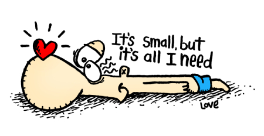

<em>Updated: 16th February 2023</em>

# What I'm Doing Now

## Web Dev
I've been fiddling a lot with web development again after many years. Currently, I'm learning [Deno](https://deno.land/) which is the relative of Node.js and I'm reading up on WordPress theme development as I've got an idea to create a blogging focused WordPress theme that is elegant in design and function; too many WordPress themes these days try to do it all.

I actually don't like using WordPress anymore, I prefer the simplicity of static site generators, but there is a market for WP thmes.

Speaking of blogging platforms, I've been kind of obsessed with [Blot](https://blot.im/), which <em>"turns a folder into a blog"</em> (I think this is the best elevator pitch I've ever read). I not only love the concept, but also how the creator, David Merfield, promotes, writes about and <em>is</em> Blot.

## Blogging
I switched my tiny website into a tiny blogusing Deno's blog boilerplate. I like it, but still fiddling around, and then there's Blot which I might switch to because I want to use it.

## Haiku
I've come to accept how my interests continueously shift. Last November and December I was doodling and drawing cartoons a lot, now I've been interested in the Japanese poetry, Haiku. I haven't written any of my own, but reading and researching a lot on the subject.

## Work
I started a new job this year as an remote in-house SEO for a forex broker. It's what I'm good at and I appreciate the flexibility of working from home and the salary that comes with working for a global company.

<em>This now page was inspired by [Derek Sivers](https://nownownow.com/about).</em>